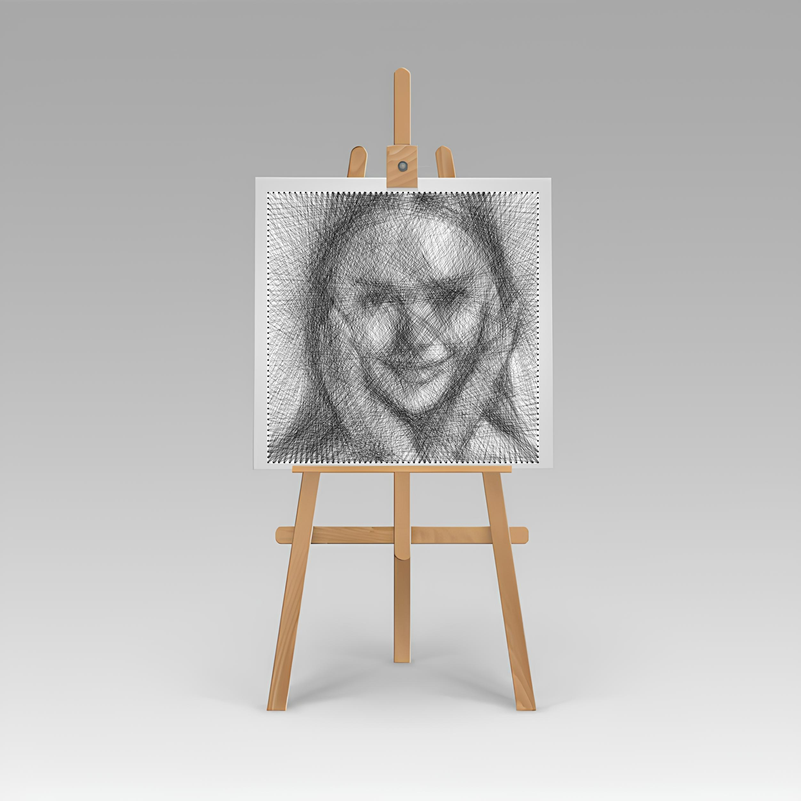

Author: Will Taylor  
Learn more: stringboard.co.uk  

A Better Open Source Python Based String Art Generation Repository
* fast: 1-2s generation with numba compiler
* accurate: previews correlated to real string art 
* optimal: feature highlighting, background removal, optimal greedy algorithm

SETUP AND DEPENDENCIES  
git clone https://github.com/StringBoardUK/string-art-open.git  
cd string-art-open  
pip install -r requirements.txt  
(or just use VS code quick create virtual environment)  

===========================================================================================
CONTENTS

main.py: main script for converting an image into string art sequence and rendering a result

StringArtEngine has the core logic for string art generation
    * image preprocessing pipeline
    * numba compiled sequence generator, compatible with importance weighting
    * result renderer - accurate and well parameterised 

StringArtUtils has useful functions:
    * making nail templates
    * generating line profiles (anti aliased line coordinates)
    * UI for importance weighting

number_reader: simple UI for reading sequence (helpful for actually stringing)

assets
    - nail_template_circle.png: full size nail template
    - nail_template_circle_sliced.pdf: sliced for 50cm board diameter
    (same for square for 50cm side length)
    - template_easel.png: high res template for rendering results (you can use your own too!)

========================================================================================================
Technical details and usage:

* Nail templates can be generated automatically, you just need to slice it to your desired size 
at rasterbator.net with 10mm margin and 5mm overlap (final size is with margins cut away)

* This string art generator has been developed by correlating physical results to model parameters, 
the best thread type: 0.1mm nylon monofilament. With this thread you should aim for 3.5-4.5k lines for 50cm board

* You can use a different thread type, but it will not be correlated so results might not be accurate

* Resolution of input image to generator does not need to be above 500x500px. String art
cannot achieve higher than 200-300px resolution, so input doesn't need to be particularly high res. Contrast lighting is far more important than resolution for inputs. This 200-300px resolution limit on results was with 50cm circular board and 200 nails - if you had say 300 nails and an 80cm board, you might start to approach the 500px resolution limit and therefore higher resolution images and generator setting could be useful

* Lines are drawn 1px thick (+anti aliasing), and line strength is calculated as follows:
line_strength = kNylon * resolution/500 * 480/board_diameter_mm
kNylon - 0.1mm nylon thread constant, and then adjusted for resolution and board diameter (nominal 1)
e.g. if you wanted to use a different thread change kNylon to a new weighting parameter

* Once sequence is generated, the code will render the final string art into a high resolution (1000x1000px) png image. 
This can then be pasted onto a template image with known centre and diameter coordinates
(I've provided a basic template, but you can use your own). Lighting can be simulated by adjusting brightness and tint

* To add a new template image for rendering
in StringArtEngine load_templates, load in new template image  
in StringArtEngine render_all_previews, add the new template coords, lighting setup and add to previews dictionary  

* Use the importance UI tool to highlight details in the string art. Can adjust the strength of this in StringArtUtils

* Do not change folder structure (it will break stuff!)